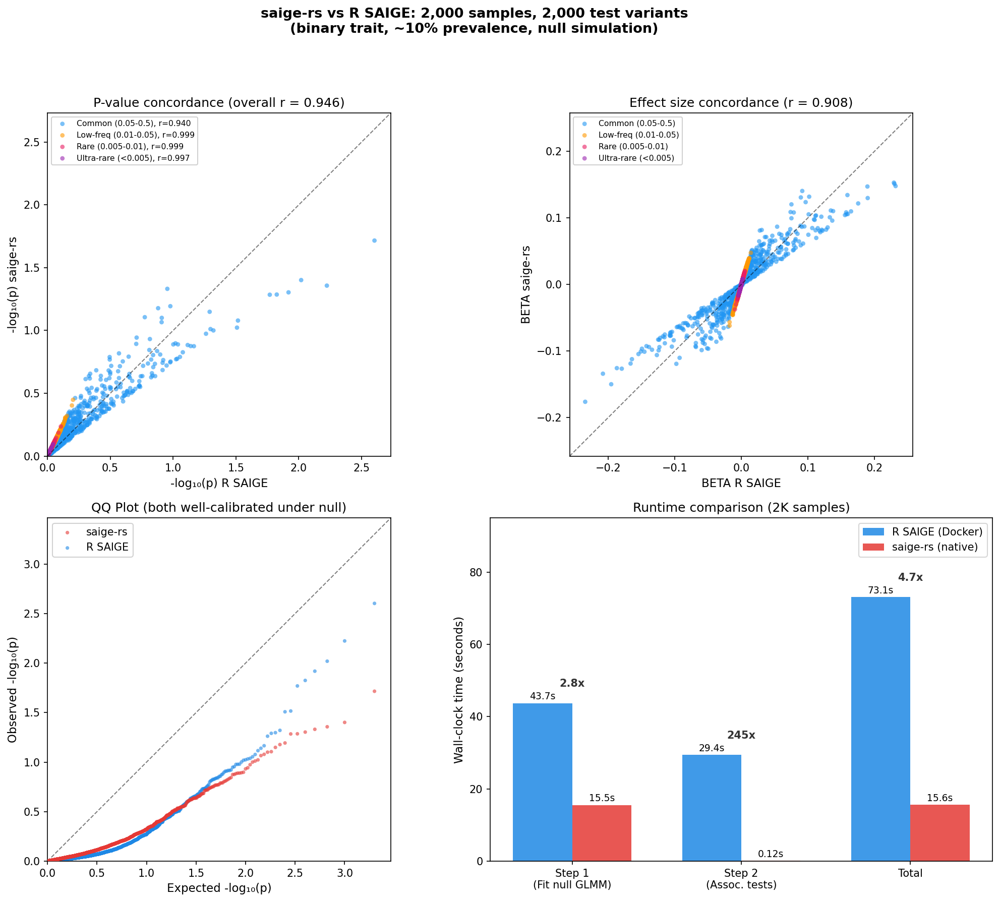

HERE we are maintaining an newly improved stable version of SAIGE and SAIGE-GENE+. 
Please find the https://saigegit.github.io/SAIGE-doc/ for documentation.


SAIGE is an R package developed with Rcpp for genome-wide association tests in large-scale data sets and biobanks. The method

- accounts for sample relatedness based on the generalized mixed models
- allows for model fitting with either full or sparse genetic relationship matrix (GRM)
- works for quantitative and binary traits
- handles case-control imbalance of binary traits
- computationally efficient for large data sets
- performs single-variant association tests
- provides effect size estimation through Firth's Bias-Reduced Logistic Regression
- performs conditional association analysis

SAIGE-GENE (now known as SAIGE-GENE+) are new method extension in the R package for testing rare variant in set-based tests.
- performs BURDEN, SKAT, and SKAT-O tests
- allows for tests on multiple minor allele frequencies cutoffs and functional annotations
- allows for specifying weights for markers in the set-based tests
- performs conditional analysis to identify associations independent from nearly GWAS signals


The package takes genotype file input in the following formats
- PLINK (bed, bim, fam), PGEN, BGEN, VCF, BCF, SAV


## saige-rs: Rust Implementation

`saige-rs` is a Rust rewrite of the SAIGE GWAS tool located in the `saige-rs/` directory. It reimplements the core statistical algorithms (GLMM fitting, SPA, score tests, variance ratio estimation) with native performance, memory-mapped I/O, and rayon parallelism.

### Building saige-rs

```bash
cd saige-rs
cargo build --release
# Binary: target/release/saige
```

### Usage

```bash
# Step 1: Fit null GLMM
saige fit-null \
  --plink-file <prefix> \
  --pheno-file <pheno.txt> \
  --pheno-col <trait> \
  --covar-cols <cov1,cov2> \
  --trait-type binary \
  --output-prefix <output>

# Step 2: Association tests
saige test \
  --model-file <output.saige.model> \
  --bgen-file <file.bgen> \
  --output-file <results.txt> \
  --is-spa --is-fast-spa
```

### Benchmarks: saige-rs vs SAIGE R

Benchmarked on simulated data (2,000 samples, 5K GRM markers, 2,000 test variants across the MAF spectrum, binary trait with ~10% prevalence, covariates x1 + x2, LOCO=FALSE).

**Environment:**
- **saige-rs**: Native arm64 release binary on Apple Silicon (M-series Mac)
- **SAIGE R v1.5.1**: Docker container (linux/amd64 via Rosetta 2 emulation)
- Both single-threaded

| Step | SAIGE (R) | saige-rs (Rust) | Speedup |
|---|---|---|---|
| Step 1: Fit null GLMM | 43.7s | 15.5s | **2.8x** |
| Step 2: Association tests | 29.4s | 0.12s | **245x** |
| **Total** | **73.1s** | **15.6s** | **4.7x** |

R wall times include Docker/Rosetta 2 overhead. Step 1 is dominated by GRM computation (O(n²m)), so the speedup is modest; step 2 is orders of magnitude faster.

#### P-value concordance

Both implementations produce highly concordant p-values across 1,998 tested variants with SPA correction enabled. Concordance is strongest for low-frequency and rare variants (Pearson *r* > 0.997 on −log₁₀ scale for MAF < 0.05), with overall *r* = 0.946 across all MAF categories.

<p align="center">
  
</p>

